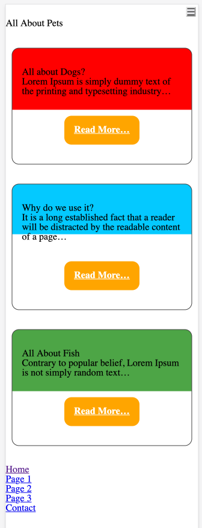

# How to Design cards

## W3Schools Link

See [this page for a reference on how to design a simple card effect](https://www.w3schools.com/howto/howto_css_cards.asp).

## Format the Home Page Content

- Reduce the amount of text per section to about one sentence or so.
- Add an ellipsis &hellip; to symbolize that the text content continues on the linked page
- Add a "card" class to each section
- Add a Read More link to each section

        <section class="dogs card">
            <h2>All about Dogs?</h2>
            
Lorem Ipsum is simply dummy text of the printing and typesetting industry&hellip;

            <a href="dogs.html" class="readmore">Read More&hellip;</a>
        </section> 
        
        <section class="why card">
            <h2>Why do we use it?</h2>
            
It is a long established fact that a reader will be distracted by the readable content of a page&hellip;

            <a href="why.html" class="readmore">Read More&hellip;</a>
        </section>
        
        <section class="fish card">
            <h2>All About Fish</h2>
                
Contrary to popular belief, Lorem Ipsum is not simply random text&hellip;

                <a href="fish.html" class="readmore">Read More&hellip;</a>
        </section>

## Design the Card and Link

        .card {
            border: 1px solid #444;
            max-width: 300px;
            margin: 2rem auto;
            padding: 2rem 1rem 2rem 1rem;
            border-radius: 12px;

            background-position: 50% -120%;
            background-size: 300px;
            background-repeat: no-repeat;
        }

        .dogs {
            background-image: url(bgimg/red-square.svg);
        }

        .fish {
            background-image: url(bgimg/green-square.svg);
        }

        .why {
            background-image: url(bgimg/blue-square.svg);
        }

        .readmore {
            display: block;
            background-color: orange;
            width: fit-content;
            padding: 1rem;
            color: white;
            font-weight: bold;
            margin: 2rem auto 0 auto;
            border-radius: 12px;
        }

## Example Rendering

