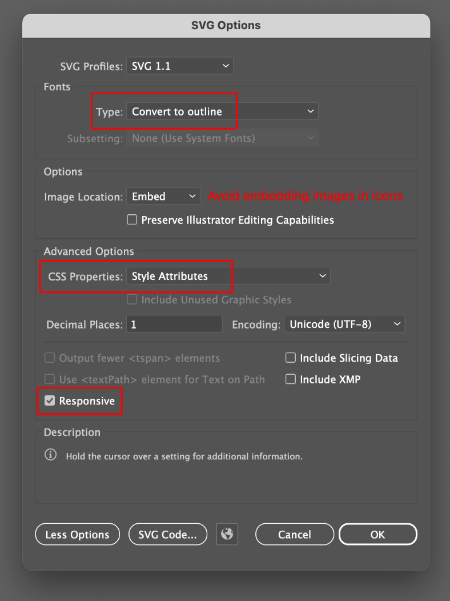

# Creating SVG Icons

## Simple Designs Make the Best Icons

Icons are made to be viewed quite small, so beware of *creating illustrations* rather than *creating icons*. Illustrations have a lot of detail and look good when viewed big. Icons are made to be viewed small and look good at sizes down to 16px x 16px. In Illustrator, if you zoom out and start losing details in your icon that's a sign that it needs to be simplified more.

## Judge your icons at 16x16

## Tips for designing easy to use icons

1. Design in black and white (you can add color with CSS)
2. Avoid too much detail
3. When saving as an SVG, **do not select "Style Elements"** This will create a CSS style tag inside the SVG code, and can lead to CSS conflicts when multiple icons are loaded on the same page.

<blockquote>

## Important!

Before exporting your SVG, **remove any embedded images such as tracing layers**. Otherwise the SVG will be very big and contain enormous amount of code, which will make reading your pages difficult. 

</blockquote>

## Optimize the SVGs After Saving

Most image files are bigger than necessary when initially saved (especially from Adobe applications). It is possible to reduce the file size of your SVG, PNG and JPEG images by running them through a [free application called ImageOptim](https://imageoptim.com/mac).

Note that ImageOptim is a Mac-only application. The ImageOptim site provides [alternatives for Windows users](https://imageoptim.com/versions.html).

### How to use ImageOptim

Simply drag and drop your image files into the ImageOptim Window. They will be compressed in place. No copies will be made, and no manually saving or managing files.