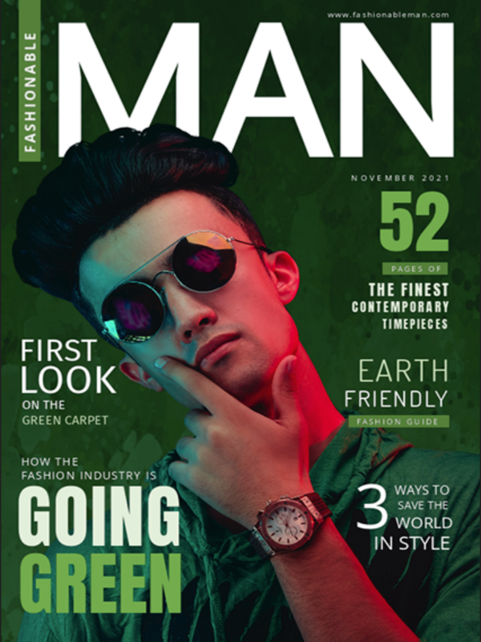
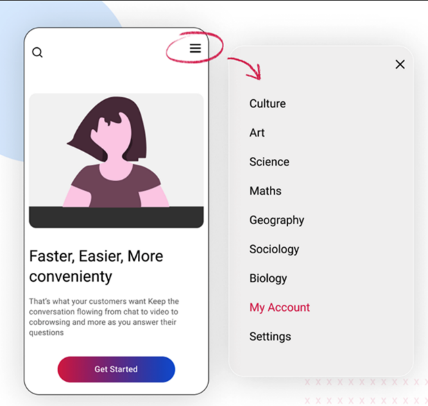

# Design Considerations

### Links

-   [Start Here](./index.md)
-   [Evaluation Criteria](./evaluation-criteria.md)
-   [Quick Start](./quick-start.md)
-   [Design considerations](./design-considerations.md)
-   [Tips & Tricks](./tips-tricks.md)
-   [Typography Tips](./global-project-typography-tips.md)
-   [Navigation How To](./navigation-how-to.md)

## Web Home Page = Magazine Cover

-   Your web site home page acts like the cover of a magazine
-   It contains an attractive image with a few titles/links
-   Each title/link refers to an \"article\" inside the magazine
-   The most important elements of the home page are:
    1.  Clear branding: name of the company and logo
    2.  Easily identifiable hamburger icon to make \'how to navigate\'
        obvious to the user
    3.  Titles/Links to the articles are well spaced apart so that they
        are easily recognized as several different things (as opposed to
        all being clumped together and looking like one single big
        element.)

## Page Layout and Negative Space

In the Global Project (Web/Mobile First), the most important aspect of
the page layout is the effective use of **margins and padding**.

1.  Use margins (top and bottom mostly) to space elements apart on the
    page.

         /* Example */
          
           header {
               margin: 0 0 2rem 0; /* values are clockwise: 0 top, 0 right, 2rem bottom, 0 left */
               padding: 1rem;
           }
          
           main {
               margin: 0 0.5rem 0 0.5rem;  /* avoid content touching the edge of the screen */
           }
          

2.  Within an element, such as header or footer for example, you can use
    **padding** to keep all child elements from touching the edge of the
    box (rather than giving margins to each one).

3.  Within the constraints of a mobile design (at 320px), you can also
    apply **display: flex;** to a parent element to position it\'s child
    elements side-by-side.

## Adobe Fonts

To include **Adobe fonts** in your web design project, so you can match
the typography in your printed piece, please [follow these instructions
on the Adobe web
site](https://helpx.adobe.com/ca/fonts/using/add-fonts-website.md).

### Typography Tips

-   Use at least two fonts: one for the titles/subtitles, and another
    for the body text.
-   If the logo and/or company name use a specific font as part of their
    visual branding, do not reuse it elsewhere in the page. Reserve it
    exclusively for the branding elements (usually found in the header).
-   Use a [typographic
    scale](https://spencermortensen.com/articles/typographic-scale/) to
    find good font size relationships.
-   Find the biggest font size by adjusting the H1 on the page with the
    longest title.

## Color palette conversion

If your color palette is defined in CMYK ink colors, use this web page
to [convert the colors to RGB
colorspace](https://colordesigner.io/convert/cmyktorgb).

## Form

We will be building the contact form together. [These instructions are a
review of what we do in class.](./form.md)

## Navigation

A basic \"hamburger\" menu icon can display navigation like this:

Check out the [https://www.mindinventory.com/blog/mobile-app-navigation-design-guide/](https://www.mindinventory.com/blog/mobile-app-navigation-design-guide/)
for some great navigation style ideas.

## Visual design rules you can safely follow every time

Once you have built your pages and validated their code, then done a first pass of styling the pages, read [(https://anthonyhobday.com/sideprojects/saferules/)](https://anthonyhobday.com/sideprojects/saferules/) to see how you can add some extra visual finesse to your pages.

