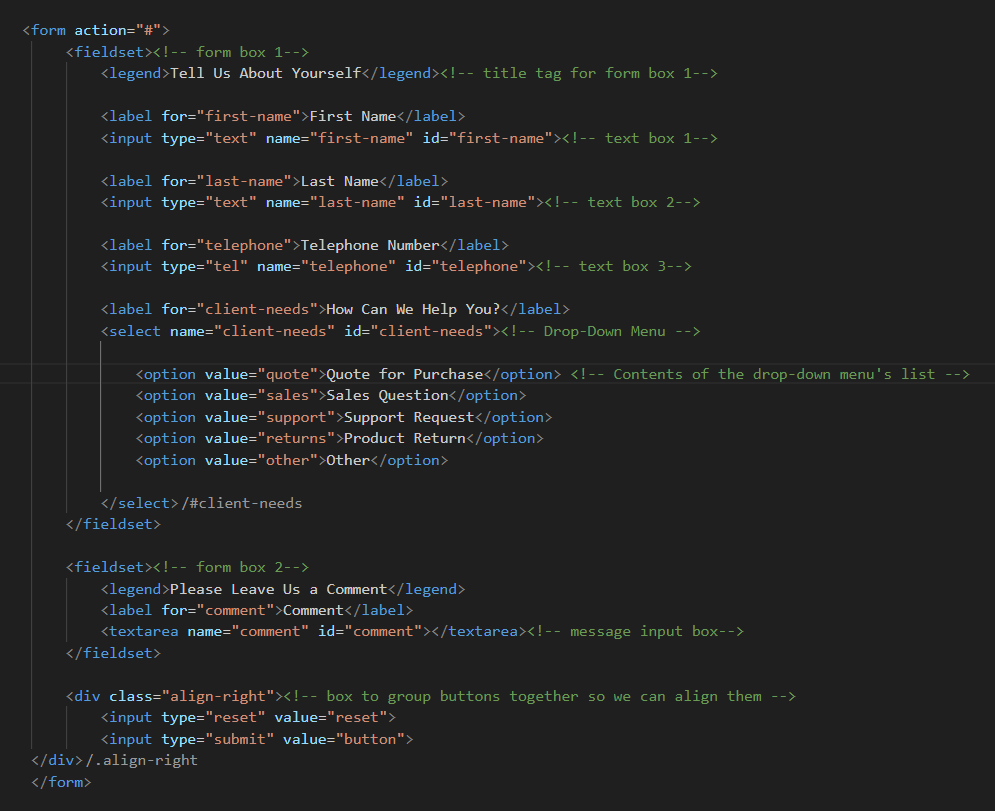

# Building the Contact Form

**Emmet Code:**

    form>fieldset>legend+(label+input:text)*2+label+input:tel^fieldset>legend+label+textarea^div.align-right>input:reset+input:submit

The illustration below shows the form code properly completed with all values:

Please feel free to customize the fields of the form according to the requirements of your
project\'s type of business or activity. See the [W3Schools page on
forms](https://www.w3schools.com/tags/tag_form.asp) and on [form
elements](https://www.w3schools.com/html/html_form_elements.asp) for
more info.

The contact form **could** look something like this:

0r something like this...

### CSS Selectors used for the Form Elements

-   form
-   fieldset
-   legend
-   label
-   input
-   textarea
-   input\[type=\"reset\"\]
-   input\[type=\"submit\"\]
-   input\[type=\"text\"\]
-   input\[type=\"tel\"\]
-   .button
-   .button:hover
-   .button:active