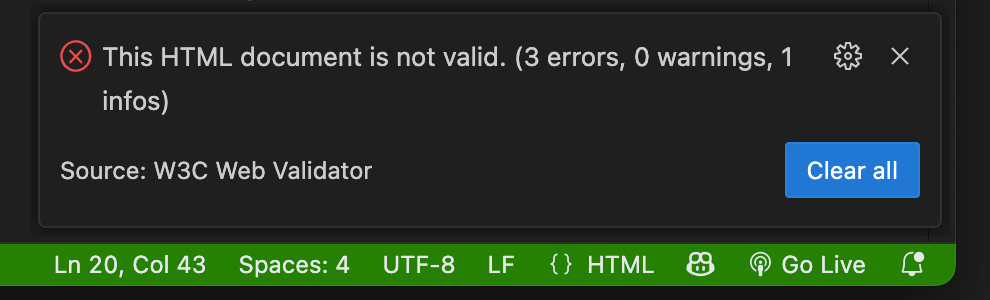

# How to Validate your HTML & CSS

1. Install the W3C Validator extension in VS Code

2. When the extension is active, it displays a text link at the bottom left of the VS Code window.

3. Open an HTML or CSS file in VS Code
4. Click the validator link.
5. You will receive either a no error message, or a confirmation of the number of errors in the file.

6. Click the error listing icon to display the list of errors.

7. A list of errors is displayed. Always start with the first error at the top, as errors on one line often trigger other errors on lines below.

8. Continue working your way down the list until no more errors are displayed.
9. This can be done for HTML and CSS files.
10. **CSS files are particularly easy to break. Validate them often.**