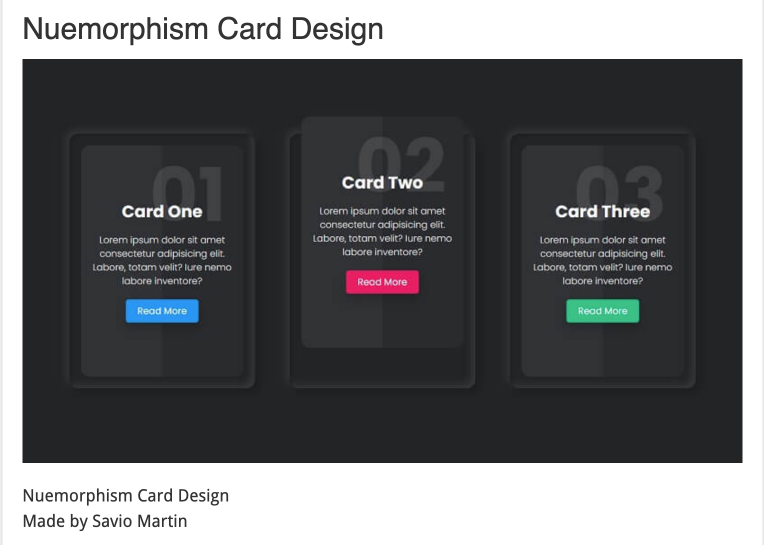

# Amount of HTML content on the home page

## Purpose of the home page

A web home page lets the user **preview** what content can be found on the site. The preview can be in the form of a picture, and a small amount of text. The text can be in the form of the name of the subtopic, or part of the first sentence followed by a [read more link...](#). See the cards below as an example.

### Web Home Page = Magazine Cover

-   Your web site home page acts like the cover of a magazine
-   It contains an attractive image with a few titles/links
-   Each title/link refers to an \"article\" inside the magazine
-   The most important elements of the home page are:
    1.  Clear branding: name of the company and logo
    2.  Easily identifiable hamburger icon to make \'how to navigate\'
        obvious to the user
    3.  Titles/Links to the articles are well spaced apart so that they
        are easily recognized as several different things (as opposed to
        all being clumped together and looking like one single big
        element.)

### Example of HTML Card Design

Cards can provide "previews" of different pages in the form of [boxes that link to the pages within the site](https://www.w3schools.com/howto/howto_css_cards.asp).

[Courtesy of https://ventasoftware.com/css-cards/](https://ventasoftware.com/css-cards/)