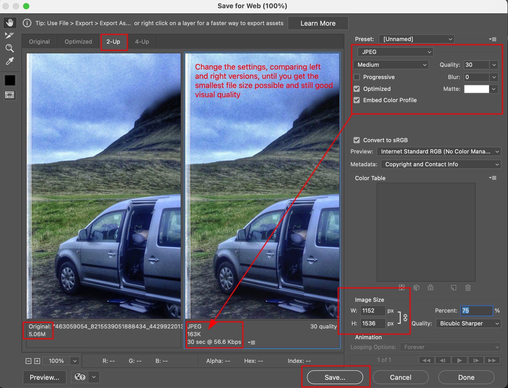

# How to Size Image for Mobile

## Important Concepts

- Most screens are "retina displays" (this is what Apple calls them). This means that the screen has at least 2x the amount of pixels for a given screen size. 
- Mobile devices can be 2x, 3x, 4x or even more.
- The rule of thumb is create an image twice as big as its size on screen. For example: if an image is supposed to be 200px wide on screen, export it from the photo editing software as 400px wide.
- Most humans can't tell the difference in between a 2x and a 3x (or higher) image.
- File sizes grow exponentially above 2x, so there is no advantage of making the files so big.
- Tablet screen sizes start at 768px wide (iPad).
- Smartphone sizes therefore are in between 320px and 768px.
- Images for smartphone use therefore need to be between 640px minimum and 1536px maximum.

## Resizing in Photoshop

1. Open the original master (full size/original quality) image in Photoshop
2. Go File > Save for Web
3. Change the settings, comparing the left (original) image and the right (optimized version) image, until you get the smallest file size while still having the best visual image quality.

### Image File Formats

- GIF and PNG-8: Flat color graphics
  - Few colors
  - Limited to a maximum of 256 colors
  - Artwork often created in Illustrator
  - Flat colors, no shading or gradients
  - Not photographs
- PNG-24: High quality transparency only
  - Saves excessively large files because it supports the same amount of transparency as Photoshop does
  - Does not compress images very well
  - Avoid at all costs unless it's the only option
  - Better to fake the illusion of transparency in Photoshop and save as PNG-8 or JPEG
- JPEG
  - Only for photographs
  - Compresses by losing information, never save multiple times in JPEG format (always use a master PSD or TIFF)
  - Supports millions of colors

### Color Space

Images to be saved for use on the World Wide Web must be saved as **sRGB** (Internet Color/Not Color Managed)