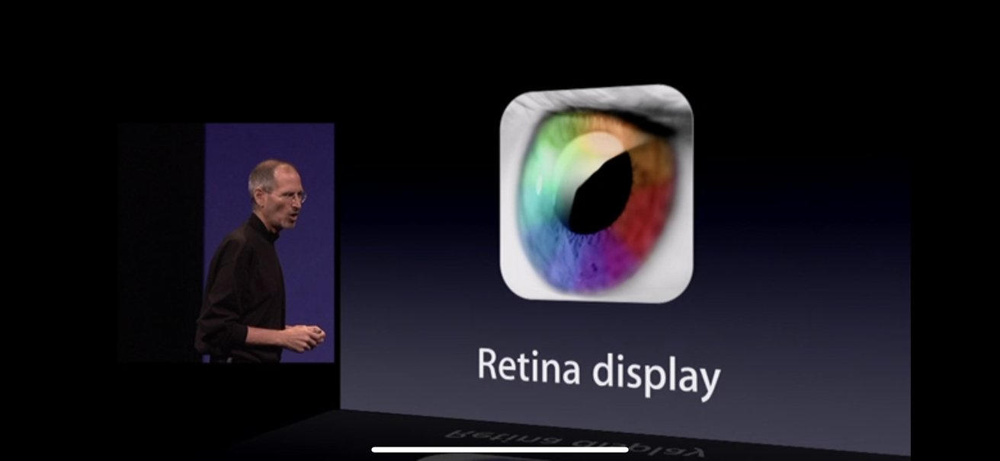

# How to Size Image for Mobile

## Important Concepts

- Most screens are "retina displays" (this is what Apple calls them). This means that the screen has at least 2x the amount of pixels for a given screen size. 
- Mobile devices can be 2x, 3x, 4x or even more.
- The rule of thumb is create an image twice as big as its size on screen. For example: if an image is supposed to be 200px wide on screen, export it from the photo editing software as 400px wide.
- Most humans can't tell the difference in between a 2x and a 3x (or higher) image.
- File sizes grow exponentially above 2x, so there is no advantage of making the files so big.
- Tablet screen sizes start at 768px wide (iPad).
- Smartphone sizes therefore are in between 320px and 768px.
- Images for smartphone use therefore need to be between 640px minimum and 1536px maximum.