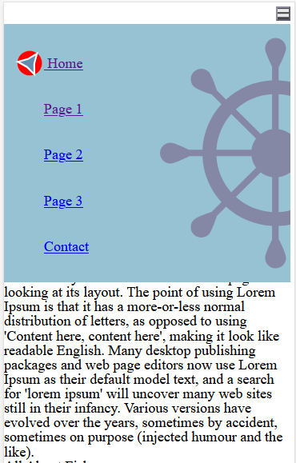

# Designing the Navigation Menu

## 1. Align the Hamburger Icon

Like we did in the contact form's buttons, we will use **flexbox** to align our hamburger icon to the right. We will use **padding** to keep the icon from touching the edge of the screen.

        .primary-navigation {
            display: flex;
            justify-content: end;
            padding: 4px;
        }

## 2. Add a background color to the menu so we can see it

Add the following  properties to your CSS:

- background-color (so that you can see the menu's layer is above everything else)
- a top value to move the menu below the hamburger
- a width to make the menu take up the width of the phone
- padding so the menu items don't touch the inner edge of the menu

       ul#menu.show-nav {
            background-color: aliceblue;
            top: 1.5rem;
            width: 100%;
            padding: 1rem;
        }

## 3. Edit the Size of the SVG Icons

        #menu svg {
            display: inline-block; /* use "inline-block" to place icon next to text; OR use "block" to place icon above text instead */
            height: 2rem;
            width: 2rem;
        }

## 4. Vertically align the SVG with the Text

          #menu svg {
            display: inline-block;
            height: 2rem;
            width: 2rem;

            position: relative;  /* relative to the SVG's default position */
            top: 0.7rem;
        }

## 5. Add a custom cursor to the hover state 

Although this cursor would not be visible on a mobile device (because
there is \"hover\" state when using your finger on a touch screen) we
can still add a custom cursor for mouse users.

        button:hover {
            cursor: pointer;
            }

## 6. Spread Links Apart for Better UX

For easing tapping with fingers, links should be at least 32px apart.

        #menu.show-nav li {
            margin: 0 0 1rem 0;
            padding: 0;
        }

## 7. Decorate the Navigation Creatively

Similar to the footer exercise and the comment box in the contact form, add some background images to the menu.

        ul#menu.show-nav {
            background-image: url(bgimg/navigation.svg);
            background-size: 16.2rem;
            background-repeat: no-repeat;
            background-position: 287% 50%;
        }

### BONUS: Hide button and display menu horizontally on desktop 

This first half of the bonus marks uses a [media query](https://www.w3schools.com/css/css3_mediaqueries.asp) to hide the hamburger icon and display the menu permanently when the web site is viewed on a large screen. The query specifies "screen" only (as opposed to "printer"), ands only applies if the screen is wider than 64rem (64 x 16px = 1024px) wide.

        @media only screen and (min-width: 64rem) {
            button {
                display: none;
            }

            #menu {
                display: flex !important;  /* !important will override the display: none which is the mobile default */
            }
        }

