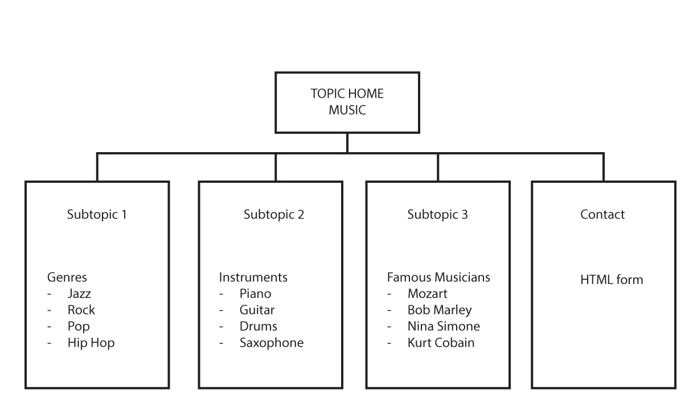
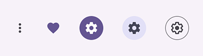

# Global Project Quick Start Guide for Web Design

### Links

-   [Start Here](./index.md)
-   [Evaluation Criteria](./evaluation-criteria.md)
-   [Quick Start](./quick-start.md)
-   [Design considerations](./design-considerations.md)
-   [Tips & Tricks](./tips-tricks.md)
-   [Typography Tips](./global-project-typography-tips.md)
-   [Navigation How To](./navigation-how-to.md)

## 1. Sketch a Site Map to Plan Your Site Visually

(Sample site map only)

Before starting the production of the web site, take a few minutes to
sketch out the site plan. Specifically, do this:

-   List all the page names (Acme Pet Shop) and file names (index.html).
-   Write down the purpose of the page (communication strategy).
-   Plan what kind of images go on the different pages.
-   Use your InDesign document for reference.

### List Subtopics per Page

In each square of the sitemap, list a few subtopics in bullet form. For example:

- music.html
    - jazz
    - rock
    - pop
    - hip hip

## 2. Sketch Your Design Ideas

Before starting to code, take the time to sketch your basic design
ideas.

-   Plan what you will say on different parts (future \<section\> tags)
    of the page.
-   Plan where different images will go on the page.
-   Plan which page elements would go side-by-side on a desktop page
    layout.

### Minimum 5 page web site

-   Home
-   Contact
-   3 others according to subject

## 3. Create & Compress Your Icons

Your web site navigation bar will contain icons and words, as in our
last exercises. You must trace the icons based on the sketches made in
Belinda\'s class. However, make sure to **simplify** the lines as the
icons will be used small. Avoid working in Illustrator at a scale over
100%.

-   Run your SVG files through [ImageOptim](https://imageoptim.com/mac)
    (macOS only, already installed on GWD workstations) to optimize
    them.
-   Alternatives for other platforms (Windows, Linux):
    <https://imageoptim.com/versions.md>
-   Use <https://www.svgbackgrounds.com/tools/svg-to-css/> to convert
    your SVG to the CSS required for using the graphic as a background
    image.

## 4. Use This File & Folder Structure

-   index.md
-   contact.html
-   three other pages (minimum)
-   img (Content images, ie images that represent **content** not
    style/decoration. For example, a picture of the company owner is
    content. It will not change if the style of the site is redesigned.
    A texture image is used for decorative purposes (as a background
    image by the css), and belongs in the img folder within the theme
    folder.)
-   theme
    -   css
    -   bgimg (only decorative images referred to by the css)
    -   js

### Sample file hierarachy (for a restaurant site)

    ├── contact.html <-- this page is required
    ├── css
    │   ├── bgimg
    │       └── hamburger.svg
    │   ├── reset.css
    │   └── style.css
    ├── img
    │   └── logo.png
    ├── index.html  <---- this is the home page
    ├── locations.html    <---- name the other pages according to what makes sense for your project's subject
    ├── menu.html  <------------|
    └── reservations.html <-----|

## 5. Use Emmet for the Basic HTML 

-   Use the standard !-tab Emmet abbreviation.

-   Expand this Emmet abbreviation within the \<body\> tag to generate
    the required page structure:

        header>img#logo+p.slogan^nav>ul.main.navigation>li.icon*5>a>svg+span^^^^div.wrapper>main>h1^aside^footer>ul.footer.navigation>li*5^p.copyright

-   Add your content within the \<body\> and \<aside\> tags.

-   Fill in the two navigation lists.

:
## 6. Use Photography to Make the Site Look Professional 

-   Use your own photos, properly processed in Lightroom.
-   If you need a photo that you cannot take yourself, use a free &
    legal image provider such as [Unsplash](https://unsplash.com)
-   [Photographs should be saved as JPEG files, with appropriate image
    compression settings](./image-sizes.md).
-   Graphics (simple/geometric images with few colors should be saved as
    PNG or GIF). Graphics are often created in Illustrator.
-   Images taken from Unsplash can (and probably should) be
    post-processed to give them an appearance similar to the other
    images used on the site. For example, images can be toned and
    (de)saturated to provide a sense of consistency between the images.

### Image Sizing

-   Determine the **maximum size** you would want the image to appear on
    a desktop layout.
-   For example:
    -   One image in a single column layout might be 1000px wide.
    -   Two images side-by-side in a column of the same width might be
        450px wide each.
    -   Three images side-by-side in a column of the same width might be
        300px wide each.
-   Multiply the width value (ex: 450px) **by two** to get the final
    image size to export from Photoshop or Lightroom (ex: 900px). This
    is the higher resolution needed for Retina displays.

### Credit the photographer

For each photo, add a byline given credit to the photographer. When you
download an image from Unsplash, there is a popup that appears at the
bottom of the page where you can copy the attribution HTML code. Paste
this in the \<figcaption\> tag.

#### Credit Unsplash 

<figure>

<figcaption>Photo by <a
href="https://unsplash.com/@davfts?utm_content=creditCopyText&amp;utm_medium=referral&amp;utm_source=unsplash">David
Pupăză</a> on <a
href="https://unsplash.com/photos/black-flat-screen-computer-monitor-Q9-QEy1_jYI?utm_content=creditCopyText&amp;utm_medium=referral&amp;utm_source=unsplash">Unsplash</a></figcaption>
</figure>

<figure>

<figcaption>Copy the code from the Unsplash attribution popup by clicking the icon in the red box</figcaption>
</figure>

        <figure>
            

            <figcaption>Photo by <a href="https://unsplash.com/@davfts?utm_content=creditCopyText&utm_medium=referral&utm_source=unsplash">David Pupăză</a> on <a href="https://unsplash.com/photos/black-flat-screen-computer-monitor-Q9-QEy1_jYI?utm_content=creditCopyText&utm_medium=referral&utm_source=unsplash">Unsplash</a>
            </figcaption>      

        </figure>

#### Credit Your Own Work 

If you took the picture yourself, simply add a **copyright notice**
under your photo:

            <figure>
              

              <figcaption>
                &copy; Your Name Goes Here, 2025
              </figcaption>      
            </figure>